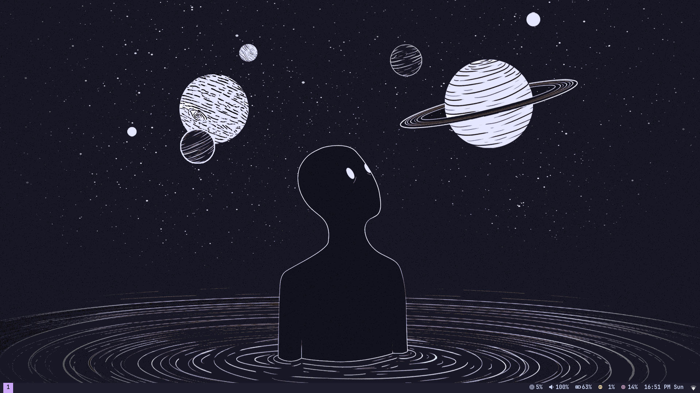
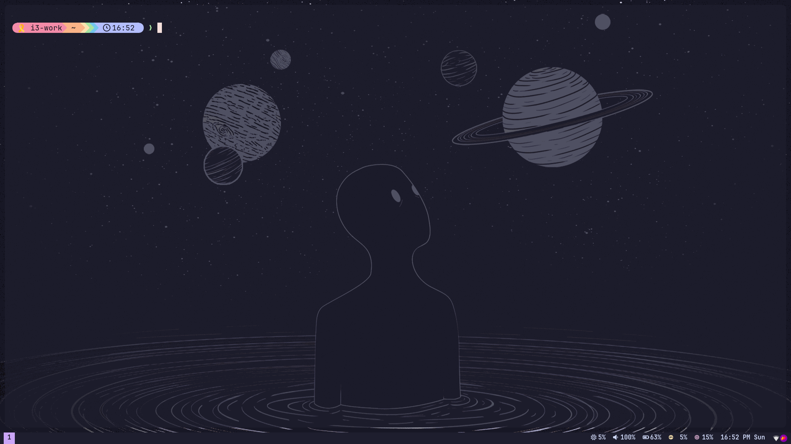
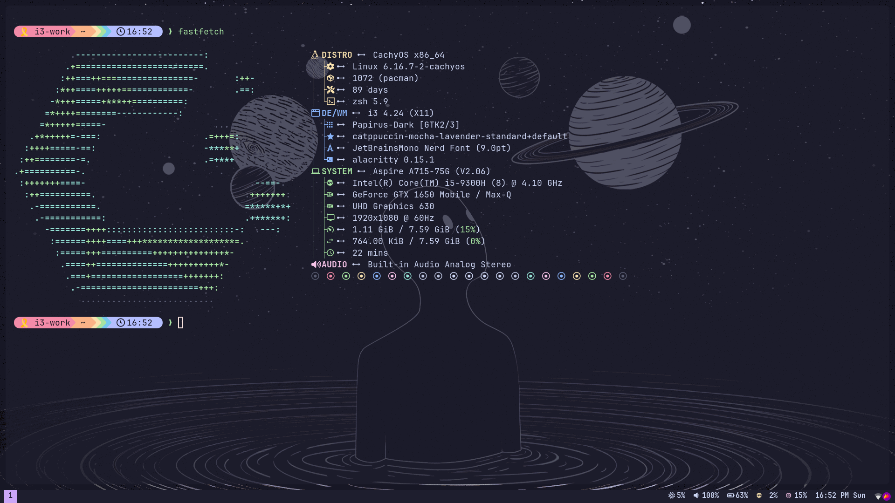
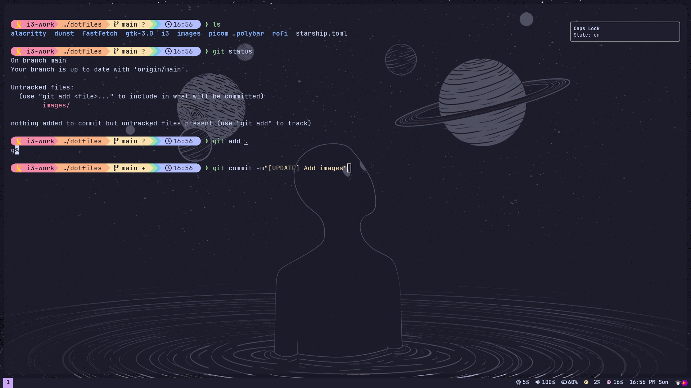

## Dotfiles: i3 + Polybar + Rofi + Alacritty + Picom + Dunst + Starship

A cohesive, Catppuccin Mocha-themed setup for the Linux desktop using i3, Polybar, Rofi, Alacritty, Picom, Dunst, Starship, and Fastfetch. Fonts, icons, and GTK theme are aligned for a consistent look.

### Preview



- 
- 
- 

### Theme & Fonts

- **Color theme**: Catppuccin Mocha (applied across i3, Polybar, Alacritty, Dunst, Starship)
- **GTK theme**: `catppuccin-mocha-lavender-standard+default` (see `gtk-3.0/settings.ini`)
- **Icons**: Papirus-Dark
- **Font**: JetBrainsMono Nerd Font

### Components

- **Window manager**: i3 (`i3/config`)
- **Status bar**: Polybar (`polybar/config.ini`, `polybar/launch.sh`, `polybar/battery.sh`)
- **Application launcher**: Rofi (`rofi/` + `rofi/scripts/`)
- **Terminal**: Alacritty (`alacritty/alacritty.toml`)
- **Compositor**: Picom (`picom/picom.conf`) with rounded corners and animations
- **Notifications**: Dunst (`dunst/dunstrc`)
- **Prompt**: Starship (`starship.toml`)
- **System info**: Fastfetch (`fastfetch/config.jsonc`)

### Keybindings (i3)

- **Mod**: Super (`Mod4`)
- **Launch terminal**: `Mod+Return`
- **Launcher**: `Mod+d` (rofi app launcher), `Mod+x` (power menu)
- **Kill window**: `Mod+Shift+q`
- **Focus**: `Mod+h/j/k/l` or arrow keys
- **Move window**: `Mod+Shift+h/j/k/l` or Shift+arrows
- **Split**: `Mod+b` (horizontal), `Mod+v` (vertical)
- **Layouts**: `Mod+s` (stacking), `Mod+w` (tabbed), `Mod+e` (toggle split)
- **Fullscreen**: `Mod+f`
- **Tiling/floating**: `Mod+Shift+Space`
- **Workspaces 1–5**: `Mod+1..5` (move with `Mod+Shift+1..5`)
- **Resize mode**: `Mod+r` (then h/j/k/l or arrows)
- **Redshift toggle**: `Mod+Shift+n`
- **Show current song**: `Mod+m`
- **Reload/Restart/Exit i3**: `Mod+Shift+c` / `Mod+Shift+r` / `Mod+Shift+e`

### Media & System Keys

- **Volume**: XF86AudioRaise/Lower/Mute → uses `pamixer` + Dunst notifications
- **Brightness**: XF86MonBrightnessUp/Down → uses `brightnessctl` + Dunst notifications
- **Media**: Play/Pause/Next/Prev/Stop → uses `playerctl`
- **Screenshots (Flameshot)**:
  - `Print` → GUI to select area (saves to `~/Screenshots`, copies to clipboard)
  - `Shift+Print` → full screen
  - `Mod+Print` → full screen with 5s delay

### Autostart

- `picom` (rounded corners, animations)
- Polybar (`polybar/launch.sh`)
- `dunst` (notifications)
- `nm-applet` (network)
- Wallpaper via `feh` (edit path in `i3/config`)
- Lock keys notifier (`i3/scripts/lock-key-notifier.sh`)
- GTK icon theme set via `gsettings` (Papirus-Dark)

### Scripts

- `i3/scripts/brightness-notification.sh`: Dunst OSD for brightness (brightnessctl)
- `i3/scripts/volume-notification.sh`: Dunst OSD for volume (pamixer)
- `i3/scripts/lock-key-notifier.sh`: background notifier for Caps/Num state
- `i3/scripts/show-music.sh`: Now Playing with optional album art (playerctl + curl)
- `i3/scripts/toggle-redshift.sh`: robust Redshift toggle
- `polybar/battery.sh`: battery icon + percent (acpi)
- `polybar/launch.sh`: restart and launch bar
- `rofi/scripts/launcher.sh`: themed rofi launcher
- `rofi/scripts/powermenu.sh`: rofi power menu with confirmation

### Dependencies

- Core: i3, xorg, `picom`, `polybar`, `rofi`, `alacritty`, `dunst`, `feh`, `redshift`, `playerctl`, `pamixer`, `brightnessctl`, `acpi`, `curl`, `nm-applet`
- Fonts/Icons/Theme: JetBrainsMono Nerd Font, Papirus-Dark, Catppuccin Mocha GTK theme
- Prompt/Info: `starship`, `fastfetch`
- Screenshots: `flameshot`

Example install (Arch-based):

```bash
sudo pacman -S i3-wm xorg-server picom polybar rofi alacritty dunst feh redshift playerctl pamixer brightnessctl acpi curl noto-fonts-emoji flameshot starship
# AUR or manual: nerd-fonts-jetbrains-mono papirus-icon-theme fastfetch catppuccin-gtk-theme-mocha
```

Example install (Debian/Ubuntu):

```bash
sudo apt install i3 xserver-xorg picom polybar rofi alacritty dunst feh redshift playerctl pamixer brightnessctl acpi curl fonts-noto-color-emoji flameshot starship
# Nerd Font + Papirus + Catppuccin GTK via manual install
```

### Setup

- Place configs under `~/.config/` and top-level files under `$HOME`:

```bash
mkdir -p ~/.config
ln -s "$PWD/alacritty" ~/.config/
ln -s "$PWD/dunst" ~/.config/
ln -s "$PWD/fastfetch" ~/.config/
ln -s "$PWD/i3" ~/.config/
ln -s "$PWD/picom" ~/.config/
ln -s "$PWD/polybar" ~/.config/
ln -s "$PWD/rofi" ~/.config/
ln -s "$PWD/gtk-3.0" ~/.config/
ln -s "$PWD/starship.toml" ~/.config/
```

- Set Starship in your shell (e.g., Zsh):

```bash
echo 'eval "$(starship init zsh)"' >> ~/.zshrc
```

- Start i3 session and the autostarts will bring up Picom, Polybar, Dunst, etc.

### Known adjustments you may need

- **Wallpaper path**: edit `feh --bg-scale` image path in `i3/config`.
- **Rofi theme path**: `rofi/config` references `/home/i3-work/.config/rofi/theme.rasi`. This repo uses `rofi/launcher.rasi` and `rofi/powermenu.rasi`. Update the path or use the provided scripts which explicitly set themes.
- **Rofi terminal**: `rofi/scripts/launcher.sh` sets `-terminal terminator`. Change to `alacritty` if preferred.
- **Backlight device**: `polybar/config.ini` uses `intel_backlight`. Adjust to your device from `/sys/class/backlight/`.
- **Battery**: `polybar/battery.sh` depends on `acpi`.
- **GTK theme/icons**: ensure `Papirus-Dark` and Catppuccin Mocha GTK are installed; otherwise icons/theme fallback.

### Project structure

```
images/                  # Screenshots used in this README
alacritty/alacritty.toml # Terminal config (Catppuccin Mocha)
dunst/dunstrc            # Notification styling
fastfetch/config.jsonc   # System info display
gtk-3.0/settings.ini     # GTK theme and icons
i3/config                # i3 WM config and keybinds
i3/scripts/*.sh          # Helper scripts (volume, brightness, redshift, etc.)
picom/picom.conf         # Compositor (rounded corners, animations)
polybar/config.ini       # Status bar modules/formatting
polybar/launch.sh        # Bar launcher
polybar/battery.sh       # Battery status script
rofi/*.rasi              # Themes for launcher/powermenu
rofi/scripts/*.sh        # Rofi launcher and powermenu scripts
starship.toml            # Shell prompt config
```

### Screenshots are in `@images/`

All screenshots used above live under `images/` and are referenced in this README.

---

If you find this useful, consider starring the repo and adapting it to your hardware. Enjoy your Catppuccin Mocha desktop!
